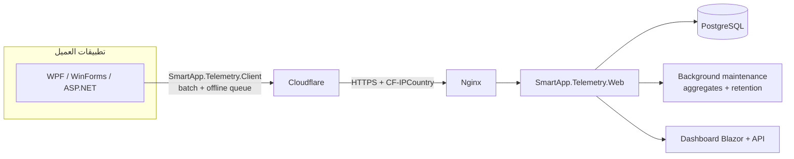

# SmartApp Telemetry

نسخة أولى بسيطة لمنصة Telemetry مركزية لتطبيقات .NET Desktop وASP.NET.

## ما تم تنفيذه

- Modular monolith واحد: Web + Infrastructure + Core.
- PostgreSQL وEF Core مع migration أولية.
- Multi-app عبر Application وApplicationId.
- Anonymous installation ID محفوظ محليًا في %LocalAppData%.
- SDK مشتركة SmartApp.Telemetry.Client، ويتم نشرها كحزمة NuGet محليًا وإلى Azure Artifacts.
- إعداد الحزمة موجود في clients/SmartApp.Telemetry.Client، وAzure DevOps pipeline في azure-pipelines.yml.
- Queue داخل الذاكرة، batching حتى 50 حدثًا، retry محدود، وoffline JSONL queue بحد أقصى.
- أحداث الاستخدام، feature tracking، استثناءات، fingerprinting، sanitization.
- Blazor Dashboard تفاعلي لعرض التطبيقات، installations، activity، versions، features والأخطاء.
- DAU/WAU/MAU مبنية على Installation.LastSeenAt.
- Rate limiting، body limit، allowed event names، health checks، وCloudflare country header.
- Background maintenance للـ daily aggregates وretention.
- Docker Compose محلي لـ PostgreSQL وWeb، وCompose إنتاجي منفصل للـ VPS.

## التشغيل المحلي

المتطلبات: .NET 10. لتشغيل Web محليًا يجب وجود PostgreSQL، ثم:

~~~powershell
dotnet restore Telemetry.sln
dotnet run --project src/SmartApp.Telemetry.Web
~~~

قبل فتح Dashboard اضبط كلمة المرور عبر المتغير `Dashboard__Password` (وفي Docker استخدم `DASHBOARD_PASSWORD` داخل `.env`).

أو شغّل كل شيء:

~~~powershell
docker compose up --build
~~~

لبناء حزمة العميل محليًا:

~~~powershell
dotnet pack clients/SmartApp.Telemetry.Client/SmartApp.Telemetry.Client.csproj --configuration Release
~~~

ستجد الحزمة في D:\Programming\LocalNuget.

بعدها:

- Web Dashboard + API: http://localhost:8080
- API health: http://localhost:8080/health
- OpenAPI: http://localhost:8080/openapi/v1.json

غيّر كلمات مرور PostgreSQL وDashboard__AdminKey وDashboard__Password قبل أي نشر عام.

## النشر إلى VPS

يحتوي DeployToVPS.yml على pipeline الإنتاج. عند الدفع إلى main يقوم بـ:

- بناء واختبار الحل ونشر SmartApp.Telemetry.Client إلى Azure Artifacts.
- بناء ودفع صورة ghcr.io/nadir-mezhoudi/smartapp-telemetry إلى GHCR.
- الاتصال بالـ VPS عبر خدمة Azure DevOps المسماة vps-ssh وتشغيل docker-compose.vps.yml في /opt/smartapp-telemetry.

يجب إعداد خدمتي Azure DevOps باسم ghcr-login وvps-ssh. يجب أن يحتوي الـ VPS مسبقًا على docker-compose.vps.yml وملف .env مبني على [.env.example](.env.example)، وأن يكون قادرًا على سحب صورة GHCR. لا تُحفظ الأسرار داخل المستودع أو YAML.

## تسجيل تطبيق جديد

~~~powershell
curl -X POST http://localhost:8080/api/v1/applications -H "Content-Type: application/json" -d '{"name":"SmartPharm","slug":"smartpharm"}'
~~~

## دمج تطبيق WPF/WinForms

أضف مرجع مشروع الـ SDK أو حوّلها لاحقًا إلى NuGet:

~~~csharp
services.AddTelemetry(options =>
{
    options.Application = "smartpharm";
    options.Endpoint = "https://telemetry.example.com";
    options.Version = AppVersion.Current;
    options.EnableAnalytics = true;
    options.EnableCrashReporting = true;
});
~~~

ثم استخدم:

~~~csharp
var telemetry = services.GetRequiredService<ITelemetryClient>();

telemetry.TrackAppStarted();
telemetry.TrackFeatureUsed("ExportPdf");

try
{
    // operation
}
catch (Exception exception)
{
    telemetry.TrackException(exception, new { operation = "ExportPdf" });
}
~~~

لـ AppDomain وTaskScheduler:

~~~csharp
TelemetryExceptionHooks.AttachProcessWide(telemetry);
~~~

وفي WPF اربط Application.DispatcherUnhandledException داخل التطبيق نفسه، لأن الـ SDK لا تعتمد على WPF:

~~~csharp
Application.Current.DispatcherUnhandledException += (_, args) =>
{
    telemetry.TrackException(args.Exception);
};
~~~

عند توقف الخادم أو الإنترنت، الـ SDK لا ترمي خطأ إلى التطبيق؛ تحفظ batch صغيرة في:

~~~text
%LocalAppData%/SmartAppTelemetry/app-name/telemetry-queue.jsonl
~~~

## API ingestion

الأحداث المدعومة:

~~~text
app_first_started
app_started
app_closed
feature_used
operation_completed
operation_failed
update_available
update_started
update_completed
update_failed
exception
fatal_exception
~~~

لا توجد أسرار داخل SDK. صفحات Dashboard محمية بكلمة مرور Dashboard__Password وتستخدم جلسة Cookie بعد تسجيل الدخول. واجهات Dashboard البرمجية تستمر في استخدام X-Admin-Key عند ضبط Dashboard__AdminKey. ingestion endpoint عام عمدًا، ولذلك يجب إبقاء rate limiting وCloudflare وNginx مفعّلة.

## Architecture

- الاستقبال (`ingestion`) عام عمدًا ومحمي بـ rate limiting وحدود الحجم والتحقق.
- الـ Dashboard محمي بكلمة مرور `Dashboard__Password` (Cookie) و`Dashboard__AdminKey` (للواجهات البرمجية).
- صيانة الخلفية تبني Daily Aggregates وتنفذ سياسة الاحتفاظ كل `Telemetry__MaintenanceIntervalHours`.

## المتغيرات الأساسية

| المتغير | الافتراضي | الوصف |
| --- | --- | --- |
| `ConnectionStrings__Telemetry` | localhost | سلسلة اتصال PostgreSQL |
| `Dashboard__Password` | فارغ | كلمة مرور دخول الـ Dashboard |
| `Dashboard__AdminKey` | فارغ | مفتاح واجهات Dashboard البرمجية |
| `UseInMemoryDatabase` | false | قاعدة InMemory للتجارب والاختبارات |
| `Telemetry__RawEventRetentionDays` | 90 | مدة الاحتفاظ بالأحداث الخام |
| `Telemetry__ErrorRetentionDays` | 180 | مدة الاحتفاظ بـ error occurrences |
| `Telemetry__MaintenanceIntervalHours` | 24 | فترة تشغيل صيانة الخلفية |
| `Telemetry__MaintenanceInitialDelaySeconds` | 30 | تأخير أول تشغيل للصيانة بعد الإقلاع |
| `Telemetry__IngestionRateLimitPerMinute` | 120 | حد الطلبات لكل عميل في الدقيقة |
| `Telemetry__LoginRateLimitPerMinute` | 10 | حد محاولات الدخول في الدقيقة |
| `Security__SecureCookies` | حسب البيئة | فرض Secure cookies خارج Development |
| `Api__ExposeOpenApi` | false | إتاحة OpenAPI في الإنتاج |

## واجهات API

| المسار | الغرض |
| --- | --- |
| `POST /api/v1/telemetry/events` | دفعة أحداث (حتى 50) |
| `POST /api/v1/telemetry/errors` | دفعة أخطاء (حتى 50) |
| `POST /api/v1/telemetry/installations/heartbeat` | نبض قلب لتحديث LastSeenAt |
| `GET /api/v1/applications` · `POST /api/v1/applications` | قائمة وتسجيل التطبيقات |
| `GET /api/v1/dashboard/overview` | ملخص عام |
| `GET /api/v1/dashboard/applications/{slug}` | ملف تطبيق |
| `GET /api/v1/dashboard/applications/{slug}/errors/{id}` | تفاصيل Error group |
| `GET /api/v1/dashboard/errors` | Error groups مع فلاتر وpagination |
| `GET /api/v1/dashboard/installations` | Installations مع فلاتر وpagination |
| `POST /api/v1/dashboard/errors/{id}/resolve` | تحديد خطأ كمحلول |
| `GET /health` · `GET /health/ready` | فحوصات الصحة |

واجهات `dashboard` تحميها الجلسة أو `X-Admin-Key`. OpenAPI متاح محليًا في Development فقط ما لم يُفعّل `Api__ExposeOpenApi`.

---

## قاعدة البيانات

يتم تشغيل MigrateAsync عند بدء API. الـ migration اليدوية الأولى موجودة في:

~~~text
src/SmartApp.Telemetry.Infrastructure/Migrations/20260816190000_InitialCreate.cs
~~~

الاحتفاظ الافتراضي:

- raw events: 90 يومًا
- error occurrences: 180 يومًا
- installations وerror groups وdaily aggregates: دائمًا

يمكن تغيير ذلك عبر:

~~~text
Telemetry__RawEventRetentionDays
Telemetry__ErrorRetentionDays
Telemetry__MaintenanceIntervalHours
~~~
